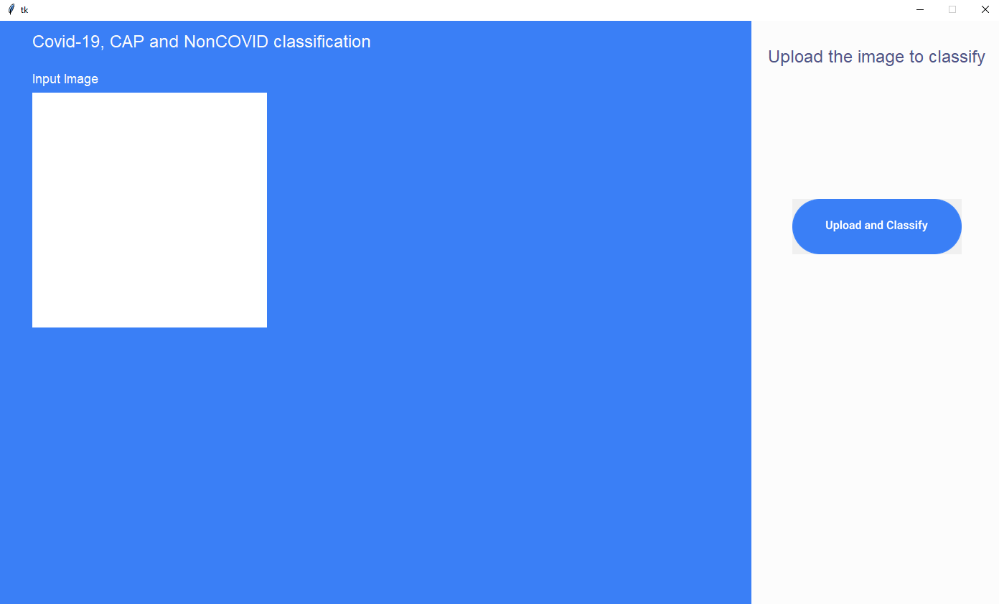
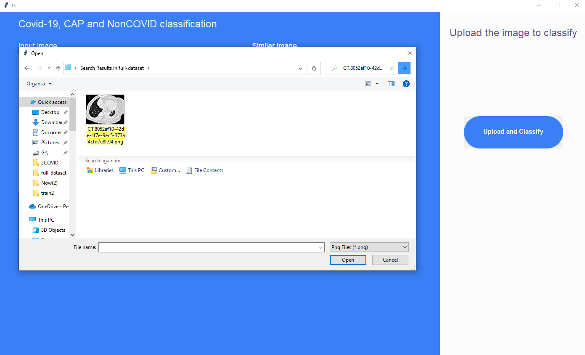
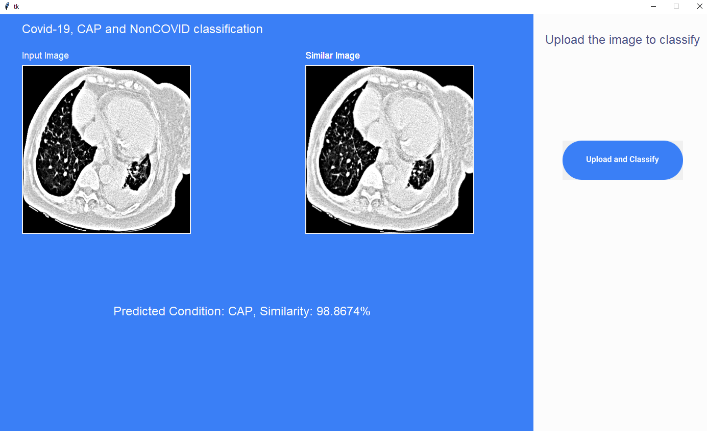
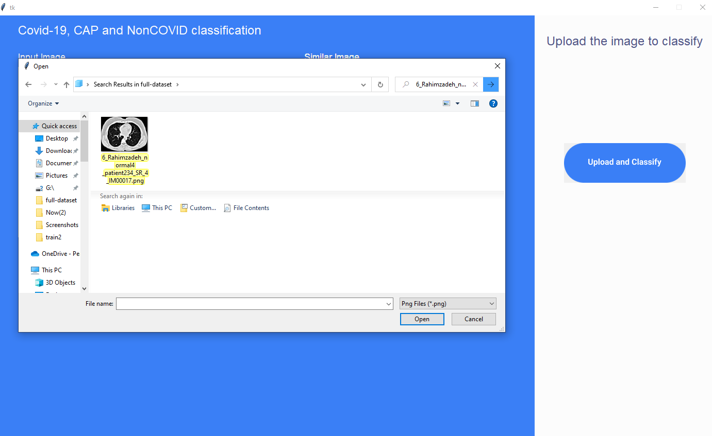
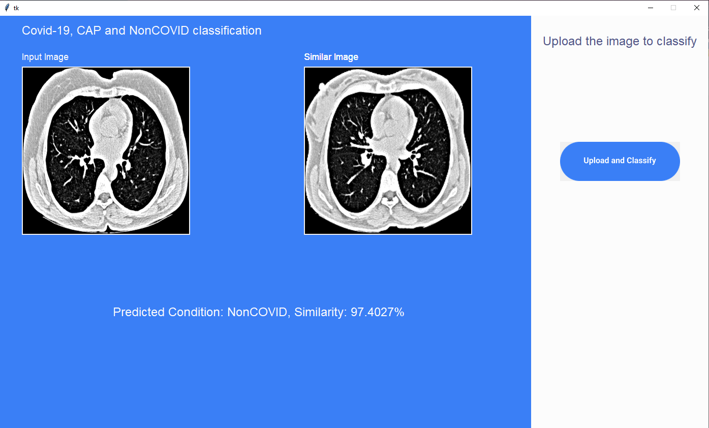
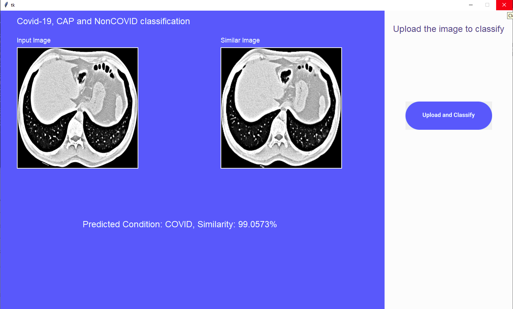

# Project Title

Detection of COVID-19 from CT scan images using Few-Shot Learning approach

## Short Description

<p align="justify">
This repository contains the interface code for the paper “CovidExpert: A Triplet Siamese Neural Network framework for the detection of COVID-19”, which is accepted in Informatics in Medicine Unlocked (among the top 6% journal in the science branch of Health Sciences), but not published yet.
A Graphical User Interface (with Tkinter) of the proposed model has been created to upload CT scan images (in jpg or png format) and check whether it is COVID-19, Community Acquired Pneumonia (CAP) infected or Normal with a similarity score. The interface is platform independent, so anyone with a poweful GPU PC would be able to run it.
</p>

## Supervisor
-----------
**Enamul Hassan**         
Assistant Professor     
Department of Computer Science and Engineering          
Shahjalal University of Science and Technology       
[Faculty Profile](https://www.sust.edu/d/cse/faculty-profile-detail/590) and [GitHub Profile](https://github.com/enamcse)

## Table of Contents

- [Project Title](#project-title)
  - [Short Description](#short-description)
  - [Supervisor](#supervisor)
  - [Table of Contents](#table-of-contents)
  - [Getting Started](#getting-started)
    - [Project Idea](#project-idea)
    - [Motivation](#motivation)
    - [Scope](#scope)
    - [Project Brief](#project-brief)
    - [Prerequisites](#prerequisites)
    - [Installing](#installing)
  - [Usage](#usage)
  - [Resources](#resources)
  - [FAQ](#faq)
  - [License](#license)

## Getting Started

For Windows User: </br>
<div style="text-align: justify">

<p align="justify">

Download and Install [Anaconda installer](https://www.anaconda.com/products/distribution) if you wish to run the project from your local computer. Open Anaconda navigator to create a virtual environment with the following command

```
conda create -y --name torch python==3.7.3
```

For Linux User: </br>
Download [Anaconda installer](https://www.anaconda.com/products/distribution) if you wish to run the project from your local computer. Open the terminal where the installer has been downloaded. To make the file executable, run 
```
chmod +x InstallerFILENAME.sh
``` 
To install it, run the following command from terminal. Accept every prompt, the installation will be finished. 

```
sh InstallerFILENAME.sh
```
To create a virtual environment execute the following command from terminal.
```
conda create -y --name torch python==3.7.3
``` 
    

### Project Idea

The fundamental principle behind few-shot learning is to train a function that predicts similarity. Let's say we have two samples denoted by x and x’ and a similarity function i.e. similarity() which measures the similarity between x and x’.  

```
If similarity (x, x’) = 1; it means that the two samples are the same.
```
```
If similarity (x, x’) = 0; it implies that the two samples are different.
```

Once the training is done, the optimized similarity function could be utilized to provide predictions for previously unseen samples (specifically, in this case, COVID-19 CT scan images). The similarity function should be able to compare the query to each sample in the support set(in meta-learning, the training set is called the support set) and determine the similarity scores. Then, the FSL model will find the sample with the highest similarity score and use it as the prediction.

### Motivation
<!-- Describe here why this project is being done. -->

Medical Imaging data is right now the biggest source of database to predict disease by computer. But training a traditional deep neural network with a medical image dataset is often very hard because in reality, a medical image dataset is very imbalanced which causes difficulty to train a DNN. Although; GAN, SMOTE and other data balancing algorithm is being used, they are not so effective when these are applied to medical image dataset. On the other hand, if the dataset is much larger, it needs a very powerful computer to process images quickly and not everyone has got access to these types of computers. To tackle this issue, we aim to evaluate few-shot learning techniques in a medical image dataset to see if a FSL model is able to compete with a traditional DNN. The goal is simple, FSL models will be trained in a very small dataset and DNN models will be trained with a much larger dataset. To benchmark the models, they will be trained on COVID-19 CT scan images. If the FSL model is able to beat/got close to the score of DNN models, we can safely assume our architecture will be a breakthrough to create an expert medical imaging diagnostic model with small but balanced dataset. </p>

### Scope
<!-- Describe the domain space of the project. -->

The scope of this project is limited to Image and Video Processing; Computer Vision and Pattern Recognition and Machine Learning. The model architecture could be applied in any image classification problem. But to use the full source code in any image classification problem, the data pre-processing, data cleansing techniques need to be altered according to the dataset.

### Project Brief

The CNN can classify images accurately. But in order to do so, they need thousands of labeled images; which is very uncommon in medical image analysis. A baby can recognize a dog or cat by seeing only a handful of images, they do it by recognizing the important features of image class. Our goal is to apply similar intuition in a machine learning model and extract meaningful features from limited number of images. This is known as few-shot learning or more formally N way K shot learning which is solving the problem of making predictions based on a small number of samples. The goal of few-shot learning isn't for the model to recognize the images in the training set before moving on to the test set. Instead, the idea is to determine how similar and dissimilar objects are. This idea could be incredibly helpful in medical image analysis since large and balanced medical image dataset is very rare. COVID-19 is a disease that has recently been discovered. Over 438 million COVID-19 infections and 5.96 million deaths have been reported worldwide as of the first week of March 2022, overwhelming the world's health-care systems and causing major economic turmoil. A chest CT scan is a useful diagnostic tool for COVID-19 pneumonia. But since the manual detection of COVID-19 is time-consuming and hard, machine learning has the chance to relieve the healthcare worker by automating the detection of COVID-19 from CT scan images.

### Prerequisites

The expert system has created using Python 3.7.3. Pytorch has been used to develop all the models. Install all the required packages listed in the 'requirements.txt' with

```
conda install -f -y -q --name torch -c conda-forge --file requirements.txt
``` 
Then activate the virtual environment with 
```
conda activate torch
```


### Installing
<p align="justify">

If the local computer's GPU and RAM does not have high performance and the user don't have/wish to run from a powerful remote server, run from [Google Colab](https://research.google.com/colaboratory/). In any of these two cases (local or Colab), the user has to download the original dataset where he/she will be working. The download link has been provided [here](https://drive.google.com/file/d/1n-eck14JZtzAaltQt1LELKvA7AoDF8Ye/view?usp=sharing). To train the model, the user need to organize the original dataset with the help of a radiologist.

To initialize the trained model:
1. Clone the repo.
2. Open a terminal into the cloned repo
3. Activate virtual environment with
    ```
    conda activate torch
    ```
4. Download the files from the [drive link](https://drive.google.com/drive/folders/1X-FPsqu379q7BkGYiWzGUAeDHoLVS_mP?usp=share_link)
5. Put the downloaded files into this folder
6. Issue the following command in the terminal
    ```
    python interface.py
    ```

    Please wait a bit, since it is a big model and without a very powerful computer it'll take a few minutes to load. After that, the GUI will pop up.
    
    <p align="center">
    Graphical User Interface </p>

## Usage

1. Upload Abdomen/Chest CT scan image (jpg/png) format to the [graphical user interface](Non-Technical-ScreenShots/1.User_Interface.png).

2. To detect the specified diseases from the images, simply upload the images by clicking on the [Upload and Classify](Non-Technical-ScreenShots/2.Uploading_CAP_Image.png) button. Select a image from the "full-dataset" folder and double click on it. The image will be uploaded.
   
    
    <p align="center">
    Uploading a CAP image </p>

3. The [prediction](Non-Technical-ScreenShots/3.Prediction_on_CAP_Image.png) will come in a few seconds along with Cosine Similarity Score. 
   <p align="center">
    Prediction </p>

4. For additional clarifications, two sets of screenshots has been provided. One set contains [uploading NonCOVID](Non-Technical-ScreenShots/4.Uploading_NonCOVID_Image.png) and [prediction on NonCOVID](Non-Technical-ScreenShots/5.Prediction_on_NonCOVID_Image.png) images and the other set contains [uploading](Non-Technical-ScreenShots/6.Uploading_COVID-19_Image.png) and [prediction](Non-Technical-ScreenShots/7.Prediction_on_COVID-19_Image.png) of COVID-19 images.
   
    
    <p align="center">
    Uploading a Normal image 
    </p>


    
    <p align="center">
    Prediction on a Normal image 
    </p>


5. To exit from the interface, simple click on the [red cross](Non-Technical-ScreenShots/8.Exit.png) located on the upper right corner.

    
    <p align="center">
    Exiting from interface 
    </p>

## Resources

For the Similarity Learning idea, some ideas were incorporated from the internet. These are all mentioned below:
<br>
    1. <a href="https://kandi.openweaver.com/python/nishnik/Deep-Semantic-Similarity-Model-PyTorch" target="_blank">Deep-Semantic-Similarity-Model-PyTorch | PyTorch implementation of the Deep Semantic Similarity Model | Machine Learning library</a> 
    </br>
    2. <a href="https://towardsdatascience.com/introduction-to-deep-similarity-learning-for-sequences-89d9c26f8392" target="_blank">An introduction to Deep Similarity Learning for sequences | by Thomas Di Martino | Towards Data Science</a> 
    </br>
    3. <a href="https://towardsdatascience.com/image-similarity-with-deep-learning-c17d83068f59" target="_blank">How to Implement Image Similarity Using Deep Learning | by Sascha Heyer | Towards Data Science</a> 
    </br>
    4. <a href="https://theaisummer.com/simclr/" target="_blank">Self-supervised learning tutorial: Implementing SimCLR with pytorch lightning | AI Summer (theaisummer.com)</a> 
    </br>
    5. <a href="https://github.com/oke-aditya/image_similarity" target="_blank">oke-aditya/image_similarity: PyTorch Blog Post On Image Similarity Search (github.com)</a> 
    </br>
    6. <a href="https://github.com/Zhenye-Na/image-similarity-using-deep-ranking" target="_blank">Zhenye-Na/image-similarity-using-deep-ranking: PyTorch implementation of "Learning Fine-grained Image Similarity with Deep Ranking" (arXiv:1404.4661) (github.com)</a> 
</br>

The official [PyTorch documentation](https://pytorch.org/docs/stable/index.html) was also used for the project.

## FAQ

1. What to do if my computer does not have the memory requirements?</br>**Ans:** At least 4 GB GPU RAM or 12 GB RAM is needed in case of running the model on CPU. Unfortunately, there is nothing I can do to solve this problem. A web interface was implemented, but since "Heroku" does not provide more than 500 MB memory, it's not possible to deploy the model and associate files in the web without paying money.

2. How much confidence threshold is satisfactory?</br>**Ans:** Any percentage of similarity over 80% should be dealt seriously, since the COVID-19 can be detected by human experts on 87% time from CT scans.

3. Why the output does not contain a similar image and prediction score?</br>**Ans:** The main reason of not getting a output is the dataset may not have images similar to input images. However, this is an unlikely issue but if you face this, please open an issue. If this is not the case, please look through the output of the terminal and open an issue with the error log.

4. Why can't I download the files from the provided drive links?</br>**Ans:** The download link is private. If any user wish to download these files, please identify yourselves and mention the reason behind your interest in this model. The link will be accessible to you with the supervisor's authorization.

## License

[](https://www.gnu.org/licenses/gpl-3.0)    


This software is licensed under the GNU General Public License (GPL) version 3.

The full text of the GPL can be found in the `LICENSE` file, or online at <https://www.gnu.org/licenses/gpl-3.0.en.html>.

</p>
</div>


